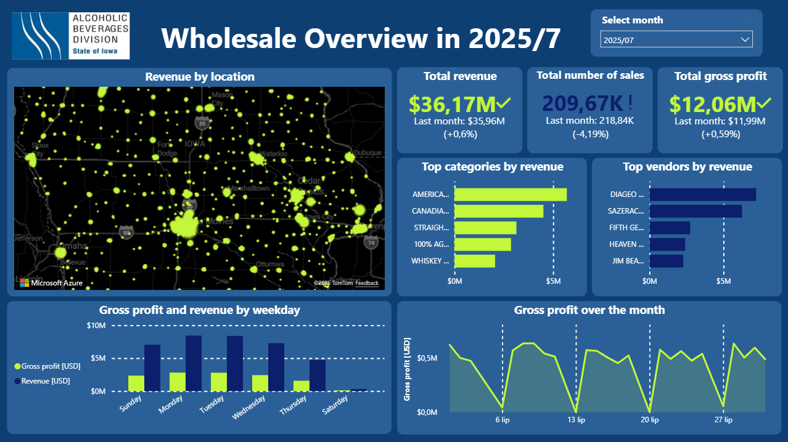
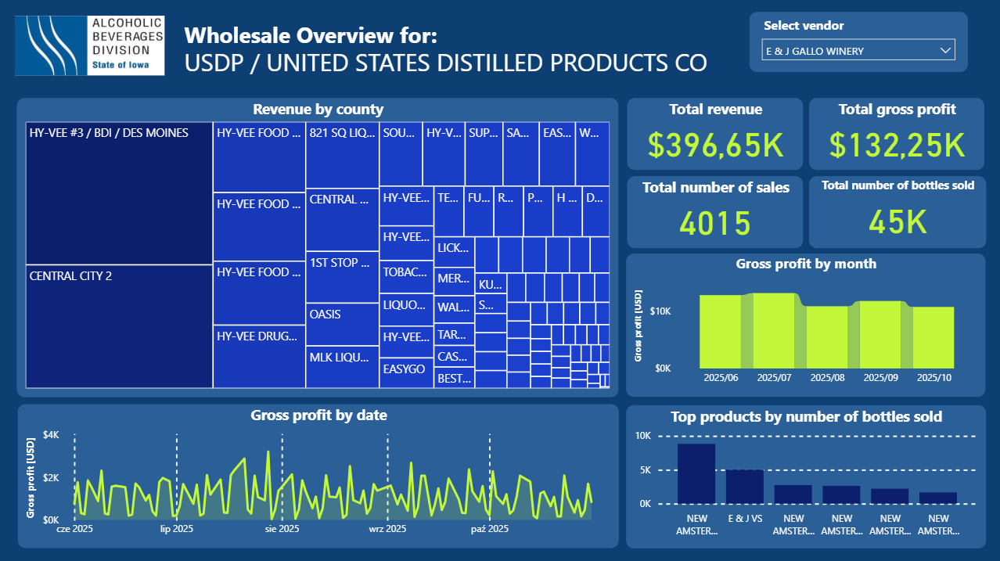
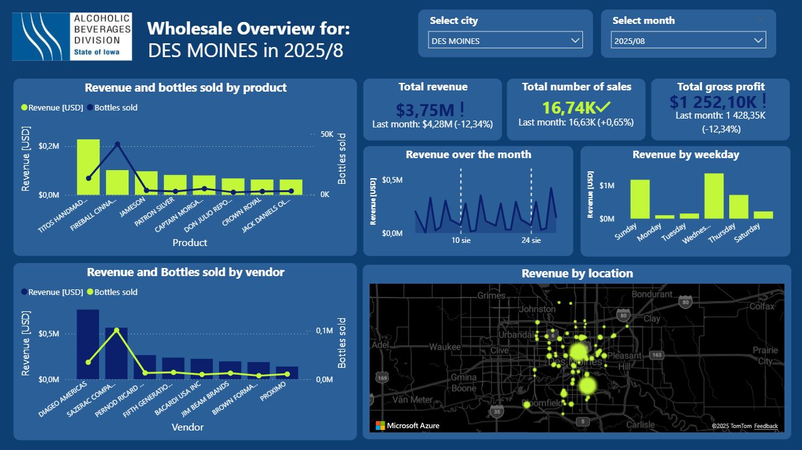
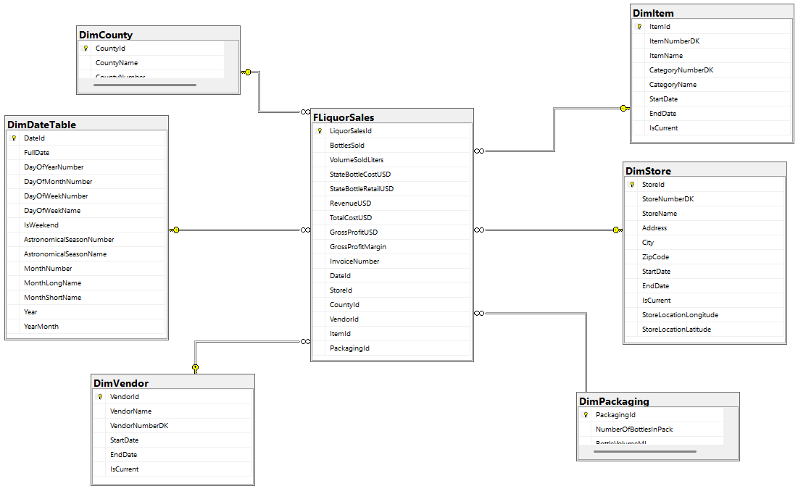
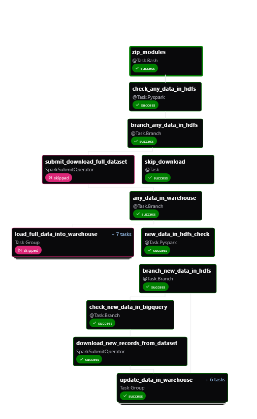
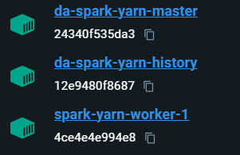

# Data Warehouse and BI Dashboards for Iowa Alcoholic Beverages Division
The project focuses on liquor wholesale data from the Iowa Alcoholic Beverages Division. Its main goal was to create a BI platform that supports data-driven business decisions. The solution consists of two main components: a **data warehouse** and **BI dashboards**.

## Technologies

This project uses the following technologies:  

- Apache Airflow  
- Apache Spark  
- Apache Yarn  
- Docker  
- HDFS  
- MS Power BI  
- MS SQL Server  
- Python  
- PySpark  

## Dashboards

The visual part of the solution consists of three dashboards:

### 1. Wholesale Overview

This dashboard provides an overall view of company performance. It includes:  

- **Revenue by location** – heat map  
- **KPIs**: Total revenue, Total number of sales, Total gross profit  
- **Top categories by revenue** – bar chart  
- **Top vendors by revenue** – bar chart  
- **Gross profit and revenue by weekday** – column chart  
- **Gross profit over the month** – line chart  

This dashboard is shown in Figure 1.  

  
*Figure 1. Wholesale Overview dashboard*

### 2. Vendor-Specific Wholesale Overview

This dashboard explores wholesale performance for a selected vendor by county, city, and store. It includes a **tree map** to allow drilling down and filtering other visuals. The visuals include:  

- **KPIs**: Total revenue, Total gross profit, Total number of sales, Total number of bottles sold  
- **Gross profit by month** – ribbon chart  
- **Gross profit by date** – line chart  
- **Top products by number of bottles sold** – column chart  

This dashboard is shown in Figure 2.  

  
*Figure 2. Vendor-specific Wholesale Overview dashboard*

### 3. City-Specific Wholesale Overview

This dashboard highlights liquor sales for a selected city and month. It includes:  

- **KPIs**: Total revenue, Total number of sales, Total gross profit  
- **Revenue and bottles sold by product** – line and clustered column chart  
- **Revenue and bottles sold by product vendor** – line and clustered column chart  
- **Revenue over the month**  
- **Revenue by weekday**  
- **Revenue by location**  

This dashboard is shown in Figure 3.  

  
*Figure 3. City-specific Wholesale Overview dashboard*

## Data Warehouse

The data warehouse environment consists of three main components:  

- **Data warehouse presentation layer**  
- **ETL pipeline**  
- **Apache Spark cluster**

### Data Warehouse Presentation Layer

The presentation layer is designed using **dimensional modeling** techniques. It uses a **star schema**, consisting of one fact table and six dimension tables. The fact table also includes a **degenerate dimension** for the invoice number.  

  
*Figure 4. Data warehouse presentation layer schema*

### ETL Pipeline

The ETL pipeline works as follows:  

1. PySpark modules are zipped and submitted to the Apache Spark cluster.  
2. The pipeline checks for existing data in HDFS.  
   - If no data exists, the full dataset is downloaded from BigQuery.  
   - If data exists, this step is skipped.  
3. The pipeline checks for existing data in the data warehouse.  
   - If data is missing, it loads all data into the presentation layer.  
   - Otherwise, it queries BigQuery for new records.  
   - If new records exist in BigQuery that are not in HDFS, they are downloaded and loaded into the warehouse.  

  
*Figure 5. ETL pipeline DAG*

### Spark Cluster
The Spark cluster is used for distributed processing of large datasets, enabling efficient ETL operations and data transformations within the warehouse presentation layer. It consists of three nodes:

- **Spark Master** – coordinates the work of the cluster and aggregates results from the workers.
- **Spark Worker** – executes the tasks assigned by the master.
- **Spark History Server** – stores metadata about Spark application executions and provides both an API and a user interface for reviewing them.
<figure>
  
  <figcaption>Figure 5. Spark cluster – Docker desktop view</figcaption>
</figure>